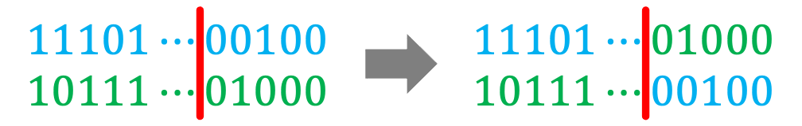

# GA_Mathematical_optimization

## Mathematical Optimization

##### Mathematical optimization or mathematical programming is the selection of the best element(s), with regard to some criterion, from some set of available alternatives. Mainly research to maximize or minimize a specific function or variable under specific circumstances. In mathematics, maximum value and minimum value (collectively called extreme value) refers to the value of the function at the point where the function achieves the maximum (or minimum) value in a domain. The point (the abscissa) at which the function takes the extreme value is called the extreme point.

### Problem Definition

* Given
  * Objective function: absolute value function  
    `|x| = x if x is positive`  
    `|x| = −x if x is negative (in which case −x is positive)`  
    `|0| = 0`
  * Domain(s): [-100, 100]
  * Maximum or minimum: minimum

* Find
  * Extreme point

* Best known solution
  * Extreme point = 0.0
  * Fitness = 0.0

---

## Program

* main.cpp

### Argument

* ROUND: number of round
* GENERATION: number of generation
* POPULATION: number of population
* MAX_POSITION: the maximum in the domain
* MIN_POSITION: the minimum in the domain
* CROSSOVER_RATE: probability of crossover
* MUTATION_RATE: probability of mutation
* MUTATE_POINT: number of the mutate point

### Result

 * output.txt

### Encoding
```
/* Each individual has the following data */
int gene[13];   // Each bit is either zero or one
long double value;
long double fitness;
```
| Value  | pow(2, -6) | pow(2, -5) | pow(2, -4) | pow(2, -3) | pow(2, -2) | pow(2, -1) |
| :----: |:----------:|:----------:|:----------:|:----------:|:----------:|:----------:|
| Index  | 0          | 1          | 2          | 3          | 4          | 5          |

| Value  | pow(2, 0) |
| :----: |:----------:|
| Index  | 6          |

| Value  | pow(2, 1) | pow(2, 2) | pow(2, 3) | pow(2, 4) | pow(2, 5) | pow(2, 6) |
| :----: |:---------:|:---------:|:---------:|:---------:|:---------:|:---------:|
| Index  | 7         | 8         | 9         | 10        | 11        | 12        |

---

## Genetic Algorithm (GA)

##### In computer science and operations research, a genetic algorithm (GA) is a metaheuristic inspired by the process of natural selection that belongs to the larger class of evolutionary algorithms (EA). Genetic algorithms are commonly used to generate high-quality solutions to optimization and search problems by relying on biologically inspired operators such as mutation, crossover and selection.

### FlowChart


#### Initialization

```
/* For each individual */
for (int i = 0; i < 13; i++) {
    gene[i] = random(0 or 1);
}
int value = 0;
int fitness = 0;
```

#### Evaluation

```
for (int i = 0; i < 13; i++) {
    if (gene[i] == 1) {
        value += (long double) (pow(2, i - 6));
    }
}

if (value > MAX_POSITION) {
    value = MAX_POSITION;
} else if (value < MIN_POSITION) {
    value = MIN_POSITION;
}

fitness = (long double) abs(value);
```

#### Selection (Tournament Selection)

Step description:  
step 1) Randomly select two individuals from the population for comparison, and put the one with lower fitness into the mating pool.  
step 2) Repeat step 1 until the number of mating pools equals the population.

#### Crossover (Single-Point Crossover)

Pick two individuals randomly from the mating pool, and then randomly generate a crossover point (the red line) ∈ [1, 99].
Starting from the crossover point (the red line), cross the two gene sequences. As shown below:



#### Mutation

* Single-Point Mutation: Every individual has a chance of mutation, but only a random bit will mutate  


* Multiple-Point Mutation: Every individual has a chance of mutation, and every bit has a chance of mutation  

